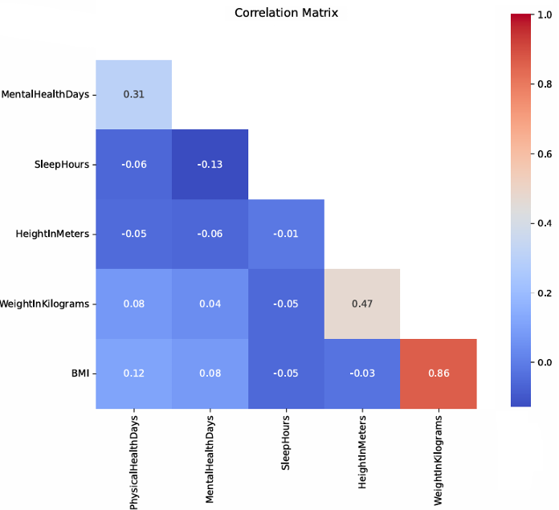
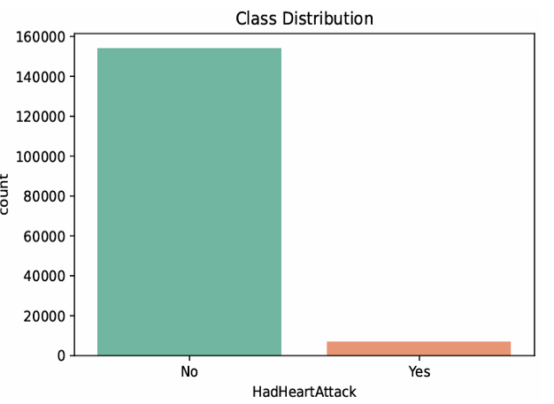
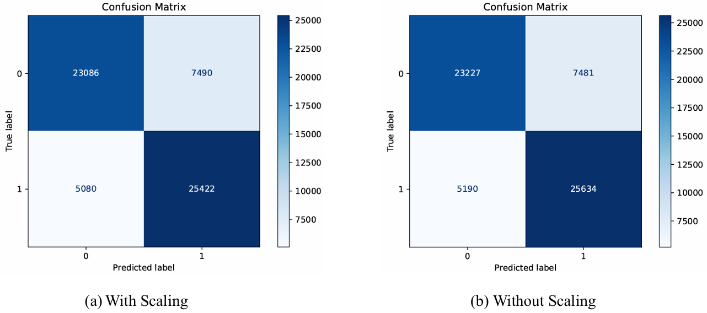
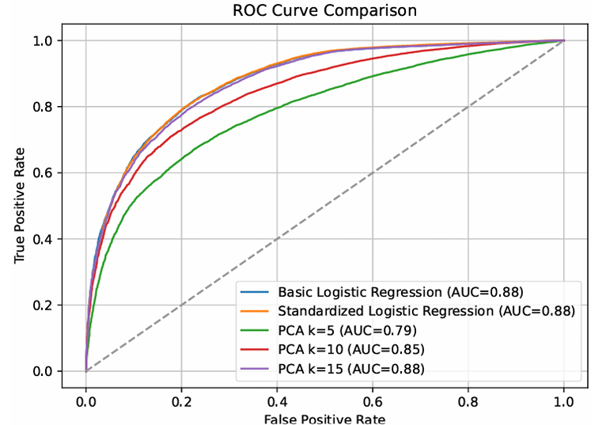

# 📊 Heart Attack Prediction with Logistic Regression using Apache Spark MLlib  

  
  
  
  

🚑 Predicting **heart attack risk** using **Big Data & Machine Learning** on a **Hadoop cluster** with Apache **Spark MLlib**.  

---

## 📌 Project Overview  

This project applies **logistic regression** in **Apache Spark MLlib** to classify whether a patient has had a heart attack.  

- **Dataset**: CDC BRFSS 2022 (~450,000 records, 40 features, 139MB)  
- **Target**: `HadHeartAttack` (Yes/No) → highly imbalanced (6% Yes, 94% No)  
- **Workflow**: Data cleaning → Exploratory Data Analysis → Class balancing → Logistic Regression Variants → Evaluation  
- **Models Compared**:  
  1. Logistic Regression (raw features)  
  2. Logistic Regression + **MinMax Scaling**  
  3. Logistic Regression + **PCA** (k = 5, 10, 15)  

Key challenges addressed:  
- Highly imbalanced target (6% Yes, 94% No)  
- Large-scale data requiring distributed processing  
- Need for interpretable results in a healthcare context  
---

## ❓ What’s the Use?  
- 🏥 **Healthcare** → Helps identify individuals at risk of heart attacks, supporting preventive care.  
- 📊 **Big Data Analytics** → Demonstrates distributed machine learning at scale using Spark MLlib.  
- 🎓 **Learning Resource** → Great example of handling **imbalanced datasets**, **scaling**, and **PCA** in a real-world pipeline.  

---

## 📂 Repository Structure
```bash
heart-attack-prediction-spark/
│── heart_attack_pipeline.py     # Spark MLlib pipeline script
│── heart_2022_with_nans.csv     # Dataset (Git LFS, ~139MB)
│── screenshots/                 # Add plots to display in README
│── .gitignore
│── .gitattributes
└── README.md
```

## ⚙️ Workflow  

- **Data Preprocessing**: handled missing values, removed duplicates, standardized categorical values, detected & removed outliers (IQR method).  
- **Class Balancing**: oversampled the minority class (`Yes`) to handle imbalance.  
- **Models Compared**:  
  1. Logistic Regression (baseline)  
  2. Logistic Regression + MinMax scaling  
  3. Logistic Regression + PCA (k = 5, 10, 15 components)  
- **Evaluation Metrics**: Accuracy, ROC-AUC Score, Confusion Matrix, Runtime  

---

## 📈 Results  

| Model                          | Test Accuracy | Test AUC | Runtime (s) |
|--------------------------------|--------------:|----------:|------------:|
| Logistic Regression (Raw)      | **0.7929**    | 0.8807    | **444.3**   |
| Logistic Regression (Scaled)   | **0.7942**    | **0.8813**| 514.5       |
| Logistic Regression (PCA k=5)  | 0.7171        | 0.7867    | 467.5       |
| Logistic Regression (PCA k=10) | 0.7663        | 0.8454    | 470.6       |
| Logistic Regression (PCA k=15) | 0.7851        | 0.8759    | 501.0       |

✨ **Best Model → Logistic Regression with Scaling**  
- Highest AUC + interpretability  
- Better detection of rare positive cases (`Yes`)    

---

## 🖼️ Screenshots  

Here are some sample outputs generated during the project:  

- **Correlation Matrix Heatmap**
  <p>
  
  </p>

- **Class Distribution (Before Balancing)**
  <p>
  
  </p>

- **Confusion Matrix**
 <p>
  
</p>

- **ROC Curve Comparison**
  <p>
  
  </p>
  
---

## 🚀 How to Run  

### Prerequisites
- Python 3.x  
- Apache Spark (PySpark)  
- Java 8  
- Hadoop (HDFS)  
- Required Python packages:
  ```bash
  pip install numpy pandas seaborn matplotlib scikit-learn pyspark
  ```

#### 1. Upload dataset to HDFS:  
   ```bash
   hdfs dfs -mkdir -p /user/<username>/inputs
   hdfs dfs -put heart_2022_with_nans.csv /user/<username>/inputs
   ```
#### 2. Submit Spark job:
   ```bash
   spark-submit --executor-memory 8g --driver-memory 8g heart_attack_pipeline.py
   ```
#### 3. Outputs generated:
   ```bash
   *.txt → model coefficients & metrics
   *.pdf → confusion matrices, ROC curves, scree plots
   pca_explained_variance.csv → PCA variance explained
   ```

## 🔮 Future Improvements
- Trying advanced oversampling (SMOTE) instead of manual duplication.  
- Comparing Logistic Regression with tree-based models (Random Forest, XGBoost).  
- Deploying the trained model as a REST API for real-time predictions.  
- Exploring explainability tools (e.g., SHAP) for feature importance.  
